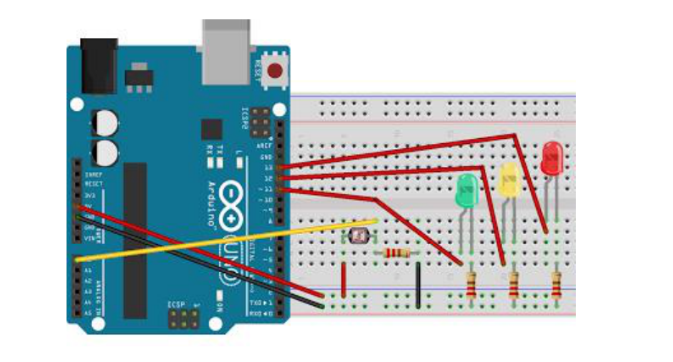

# Sensor de luminosidade com LDR
Este projeto se trata da junção da função do resistor LDR (sensível à luminosidade) com LEDs de modo a indicar o quão iluminado está o local no qual se está situado. Os três LEDs irão acender conforme a tal. Ao rodar o programa, ele lerá sob qual luminosidade o LDR está exposto e a partir daí enviar tal informação aos LEDs, que acenderão de acordo com diferentes taxas de luminosidade (baixa, média e alta).

# Exemplo de aplicação
Esse sistema pode ser aplicado, por exemplo, em conservas de pequenas plantações, que dependem da luz, de modo a saber se as espécies estão recebendo a devida iluminação para o seu desenvolvimento. Desse modo, se vê como é simples aplicar diferentes objetivos de diferentes projetos para formar uma operação maior, mostrando assim também a versatilidade do arduíno.

# O LDR
Um resistor dependente de luz ou fotorresistência, conhecido pela sigla inglesa LDR (Light Dependent Resistor), é um componente eletrônico passivo do tipo resistor variável, mais especificamente, é um resistor cuja resistência varia conforme a intensidade da luz (iluminamento) que incide sobre ele. Tipicamente, à medida que a intensidade da luz aumenta, a sua resistência diminui.
O LDR é construído a partir de material semicondutor com elevada resistência elétrica. Quando a luz que incide sobre o semicondutor tem uma frequência suficiente, os fótons que incidem sobre o semicondutor libertam elétrons para a banda condutora que irão melhorar a sua condutividade e assim diminuir a resistência.

# Componentes necessários
1 Arduino Uno R3,
1 Protobord, 
1 LDR - Light Dependent Resistor (Resistor dependente de luz),  
1 LED Vermelho,
1 LED Amarelo

# Diagrama

É importante se certificar de que os fios estão conectados exatamente como no diagrama para evitar distorções do programa quando este é rodado.
# Código
https://github.com/jpmairinque/Sensor-de-luminosidade-com-LDR/blob/master/c%C3%B3digo

